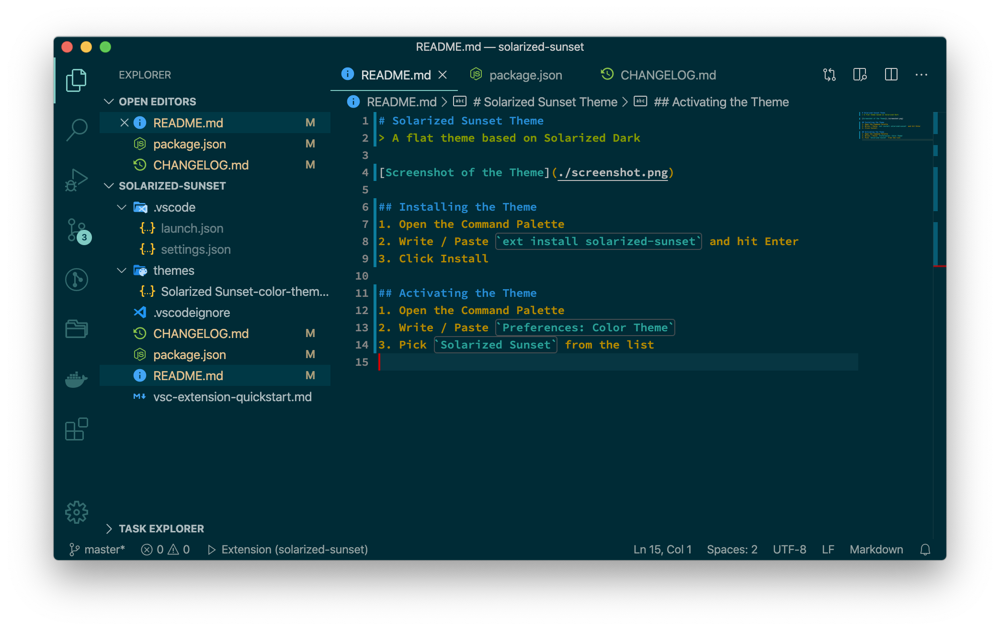
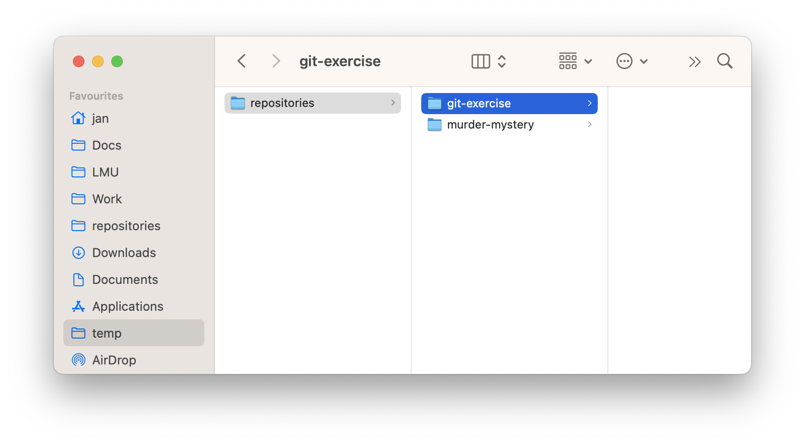

## First things first: Language 🇬🇧/🇩🇪

::: {.nonincremental}

- Slides are in English
- Spoken: German or English?
  - Do you have a preference / does anyone not speak German?

:::

## What is the course about?

- **Goal**: Learn everything that is necessary to effectively...
  - use `git` to track your own work
  - use `git` to collaborate with others
  - use `git` for social science
- **Format**: Mix of theory & practicals
  - Feel free to always ask questions any time!

## Agenda & Timeline

::: {.nonincremental}

- 9:00 - 10:30 **Block 1:** Introduction & Basics (1:30)
- 10:30 - 10:45 *Pause* ☕️
- 10:45 - 12:00 **Block 2:** Branches & More (1:15)
- 12:00 - 13:00 *Lunchbreak* 🍲
- 13:00 - 14:15 **Block 3:** Collaboration via GitHub (1:15)
- 14:15 - 14:30 *Pause* ☕️
- 14:30 - 15:45 **Block 4:** Advanced GitHub & Beyond 🧩 (1:15)

:::

The speed of the class is always a bit variable, so the number of covered topics may differ a bit.

## Introductions: Who am I? 🙋🏼‍♂️

::: {.nonincremental}

- Jan Simson
- Background
  - Computer Science (Ausbildung)
  - BSc Psychology (Konstanz)
  - MSc Behavioural Data Science (Amsterdam)
  - PhD Statistics (München)
  - Worked at research lab & startup before
- Worked with `git` for a couple of years

:::

## Introductions: Who are you? 🙋🏻‍♀️🙋🏽‍♂️🙋

::: {.nonincremental}

- What do you wish to learn from this course?
  - First time this course is geared towards social science, so we can match it to your needs
- Do you have any experience with git already?
- What's your GitHub username?

:::

## Prerequisites (Any Problems?)

- Software
  - *git*: The tool itself
  - *Sourcetree*: A graphical user interface (GUI) to use git
  - *Visual Studio Code*: A text editor, which also allows using git via its GUI

- *GitHub*: Website to collaborate via git

## Text Editor: Visual Studio Code

## Text Editor: Visual Studio Code

- Text Editor: A program to write text
  - Only text i.e. no layouting / formatting (unlike Microsoft Word)

- Quick Demonstration
  - Opening workbench in a folder

## Practical: Folder Structure {background-color="black"}

## Practical: Text Editing {background-color="black"}

1. Open Visual Studio Code on your computer
    - Explore the UI
    - Set a theme if you want to
2. Create a new folder called `repositories`
3. Inside it, create a new folder called `git-exercise`
4. Open `git-exercise` in Visual Studio Code
    - Create a new file `test.txt` and write in it   `Hello World!`

## *End of Section* 🎉 {background-color="black"}

:::{.r-fit-text}
Any Questions?
:::

[[🏡 Back to Overview]](./index.html)

[[⏩️ Next Section]](./1.1-what_is_git.html) 

[[✨ Git for Social Science]](./1.3-social_science.html) 
