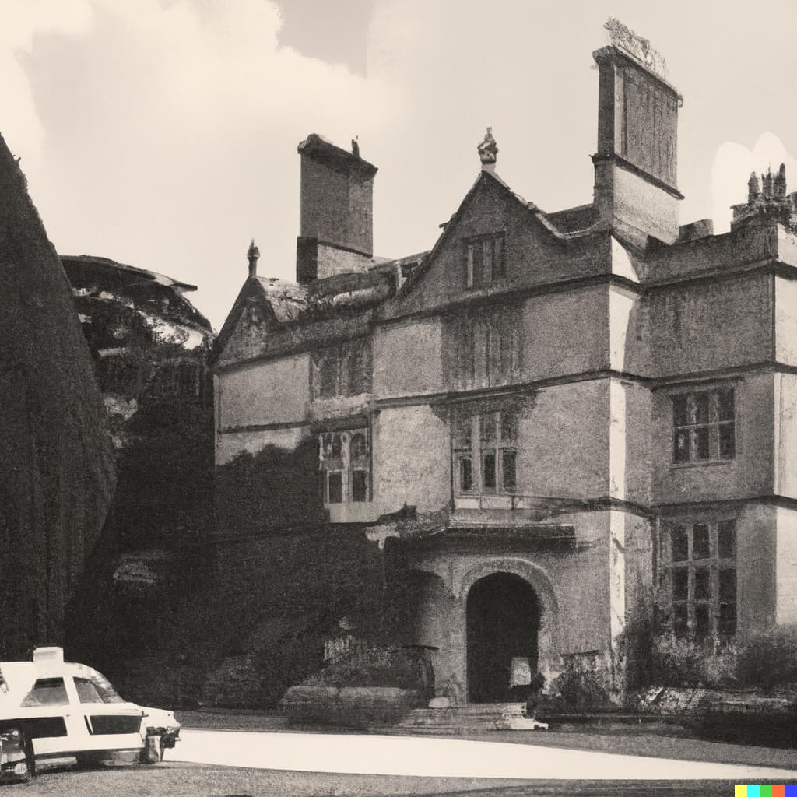

Colchester, UK - A murder has shaken the quiet town of Colchester, as the body of a wealthy businessman was found in his old mansion in the early hours of the morning. The incident took place on the night of April 26, 1973, leaving residents in shock and police scrambling to investigate the heinous crime.

According to authorities, the victim, identified as John Smith, was a prominent businessman who had recently acquired the mansion located on the outskirts of Colchester. His body was found by his butler, who had gone to wake him up for breakfast, only to discover his employer lying in a pool of blood in his bedroom.

The police were immediately alerted and arrived at the scene to find signs of struggle. It appeared that the perpetrator had access to the mansion and attacked Smith, before making a hasty exit. The current suspects are the *butler* working at the mansion, the *gardener* attending the mansion's gardens and the local *barber*, who were all found at the scene. The motive behind the murder remains unclear.

Investigators have since been scouring the area for clues, interviewing neighbors, and analyzing evidence to track down the perpetrator. Meanwhile, residents of Colchester have been left shaken by the incident and are calling for swift justice.

The police have assured the public that they are leaving no stone unturned in their investigation and are determined to bring the perpetrator to justice. They have urged anyone with information regarding the incident to come forward and assist in the investigation.

As the investigation continues, the town of Colchester mourns the loss of one of its prominent citizens and hopes for a swift resolution to this tragic incident.