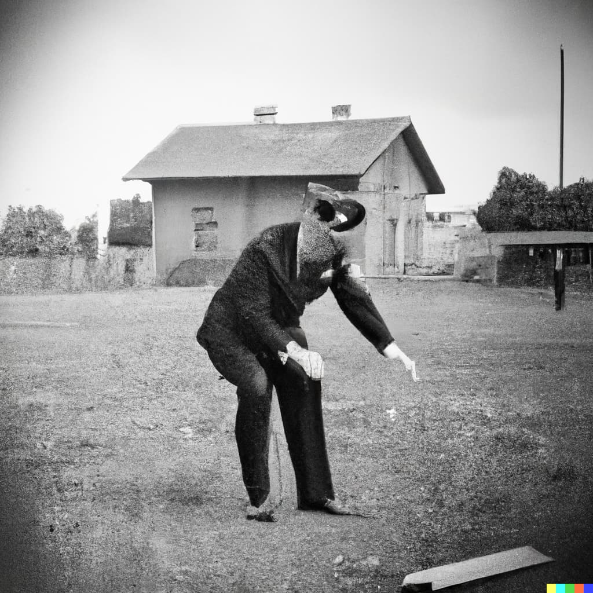

Colchester, UK - Another brutal murder has rocked the town of Colchester, leaving residents in shock and fear. The incident occurred on the night of November 12th, 1976, when the body of a young woman was discovered in a secluded area of town.

The victim, identified as Mary Jones, was a local resident and had been reported missing by her family the day before. Her body was found in a ditch near a small forest, and the police were immediately called to the scene.

The investigation into the murder has revealed that Jones had been strangled to death, and evidence at the scene suggests that she had put up a fight before being overpowered. The police have been unable to determine a motive for the crime and are currently pursuing all possible leads. Currently three suspects are in custody: The *gardener* of the abandoned Smith mansion, the local *barber* as well as the local *carpenter*.

Authorities have expressed concern that this latest incident may be linked to a string of unsolved murders that have occurred in the area over the past few years. While the police have not confirmed any connections, they have stated that they are investigating all possibilities and have increased patrols in the area.

Residents of Colchester have expressed outrage and fear at the recent string of violent crimes in their town. Many are calling for increased police presence and stricter measures to ensure the safety of the community.

As the investigation into Mary Jones' murder continues, the town of Colchester is left reeling from the shock and horror of this latest crime. Authorities have urged anyone with information to come forward and assist in the investigation, promising to do everything in their power to bring the perpetrator to justice.